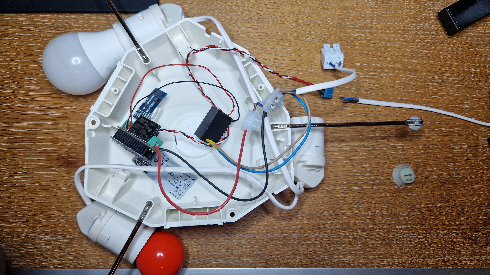

# smart Nal
Smart Nal enables ON and OFF functionality for LED ceiling lamp using Bluetooth or normal light switch.  

watch the following YouTube channel for more information.  
https://www.youtube.com/embed/videoseries?list=PLivrBlTrqPpaUyPcGpUUAaZgcAJCYTLqt
  

schematic of the Smart Nal Hardware.  
https://github.com/quractech/smart-nal/blob/2a30d1d0165a11da4ee4c517b96f4f8cc76464df/smartNal.pdf
